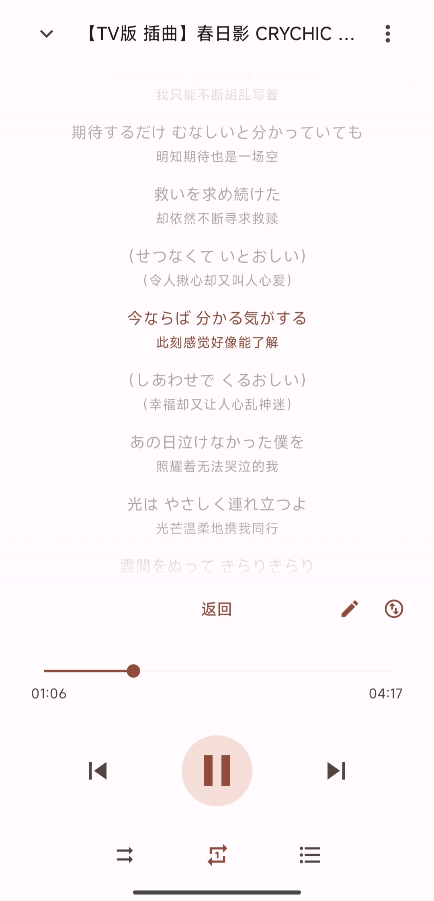

<h1>BBPlayer</h1>

一款使用 React Native 构建的本地优先的 Bilibili 音频播放器。更轻量 & 舒服的听歌体验，远离臃肿卡顿的 Bilibili 客户端。

**[前往官网查看更多详情和上手指南 ➔](https://bbplayer.roitium.com)**

## 屏幕截图

|                  首页                  |                   播放器                   |                    播放列表                    |                     下载页                     |                    库页面                    |
| :------------------------------------: | :----------------------------------------: | :--------------------------------------------: | :--------------------------------------------: | :------------------------------------------: |
|  |  |  |  |  |

## 主要功能

- **Bilibili 登录**: 支持通过扫码或手动设置 Cookie 登录。
- **播放源**: 自由添加本地播放列表，登录账号后也可直接访问账号内收藏夹、订阅合集等，兼顾快速与方便。
- **全功能播放器**: 提供播放/暂停、循环、随机、播放队列等功能。
- **搜索**: 智能搜索，随意一条链接或 b23.tv 短链，即可解析实际内容并展示。同时也有收藏夹和本地播放列表内搜索。
- **歌词**：支持自动匹配歌词（网易云/QQ 音乐）、双语歌词、桌面歌词（悬浮窗）、歌词分享卡片。
- **下载**：支持缓存歌曲并离线播放。
- **个性化**：支持浅色/深色模式。
- **实用工具**：定时关闭、播放队列管理、播放历史统计（排行榜）。
- **完善的播放体验**：响度均衡、断点续播、启动自动播放等。

## 技术栈

- **框架**: React Native, Expo
- **状态管理**: Zustand
- **数据请求**: React Query
- **UI**: Material Design 3 (React Native Paper)
- **播放库**: [Orpheus](https://github.com/bbplayer-app/orpheus)
- **ORM**: Drizzle ORM

## 项目结构

这是一个 Monorepo 仓库，包含 BBPlayer 及其相关工具和文档。

- **[apps/mobile](./apps/mobile)**: BBPlayer 移动端应用核心代码。
- **[apps/docs](./apps/docs)**: 项目文档站点。
- **[packages/](./packages)**: 共享库与工具包。

## 开源许可

本项目采用 MIT 许可。

## IOS 支持

目前项目对 IOS 进行了基础的适配，但并不提供 .ipa 包。有调试和自签能力的小伙伴可以自行拉取仓库，运行 `npx expo prebuild`，然后使用 Xcode 打开生成的项目进行打包和调试。

目前缺失的功能：

- 无法下载音频（这其实是个 bug...我在 expo-orpheus 测试软件中下载是没问题的，但是到 BBPlayer 中就下载不了了，没有任何报错信息。欢迎帮我 debug！）
- 响度均衡功能

## 错误上报与隐私

- 使用 Sentry 进行错误上报，可能会在异常发生时记录少量与 B 站相关的上下文信息（例如相关的视频标题、bvid 等），用于快速定位问题。
- 不会包含可反查或追溯到具体用户的身份信息；已关闭默认 PII 采集（sendDefaultPii=false），因此不会上传其他个人信息。
- 目前这方面实现较为粗略，欢迎 review 相关代码并就隐私保护提出意见或 PR。
- 支持关闭 Sentry：在设置中关闭错误上报后将不再上传任何信息。

## 捐赠支持

如果你觉得 BBPlayer 对你有所帮助，欢迎考虑捐赠支持，你的所有捐赠都将用于让 Roitium 吃顿疯狂星期四或是买一部 GalGame！

点击展开查看微信收款码

 

## 感谢

本项目开发过程中很多功能和设计的灵感都来自前辈们，包括但不限于：

- [AzusaPlayer](https://github.com/lovegaoshi/azusa-player-mobile)
- [BiliSound](https://github.com/bilisound/client-mobile)
- [Salt Player](https://github.com/Moriafly/SaltPlayerSource)
- [Spotify](https://spotify.com)

以及最重要的：[Bilibili](https://www.bilibili.com/)

在此表示感谢！（鞠躬）

## Star History

