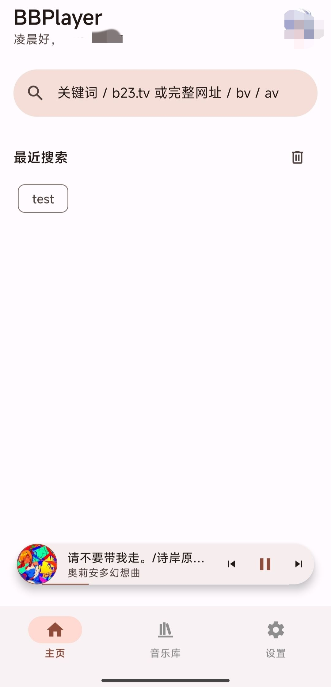
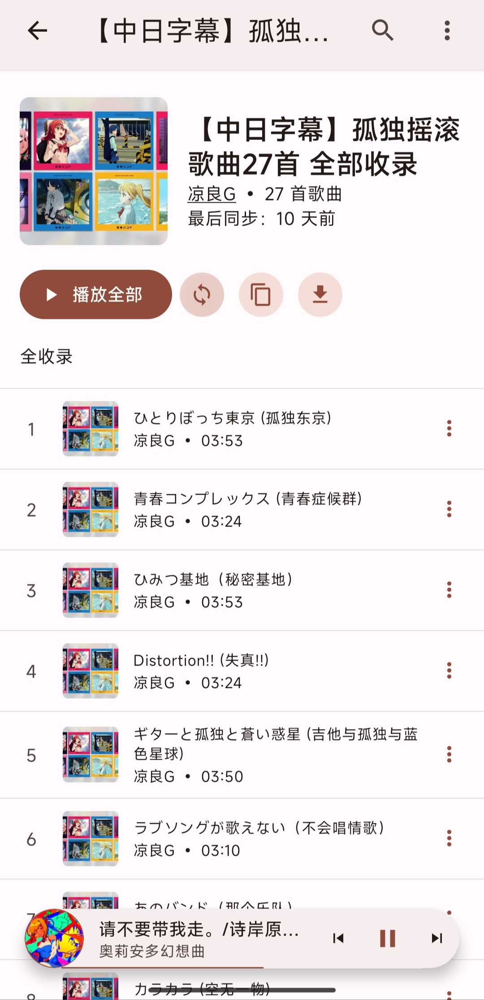

<h1>BBPlayer</h1>

一款使用 React Native 构建的本地优先的 Bilibili 音频播放器。更轻量 & 舒服的听歌体验，远离臃肿卡顿的 Bilibili 客户端。

---

**[前往官网查看更多详情和上手指南 ➔](https://bbplayer.roitium.com)**

## 屏幕截图

|                  首页                  |                   播放器                   |                    播放列表                    |                     下载页                     |                    库页面                    |
| :------------------------------------: | :----------------------------------------: | :--------------------------------------------: | :--------------------------------------------: | :------------------------------------------: |
|  |  |  |  |  |

## 主要功能

### 核心播放体验

- **Bilibili 登录**: 支持通过扫码或手动设置 Cookie 登录。
- **播放源**: 自由添加本地播放列表，登录账号后也可直接访问账号内收藏夹、订阅合集等，兼顾快速与方便。
- **导入外部歌单**: 支持从 **网易云音乐** 和 **QQ 音乐** 的歌单自动匹配到 B 站视频并保存为播放列表。
- **全功能播放器**: 提供播放/暂停、循环、随机、播放队列、响度均衡、断点续播、启动自动播放等功能。
- **弹幕**: 在播放器页面直接展示视频弹幕，还原最原汁原味的 B 站体验。
- **搜索**: 智能搜索，支持 BV/AV 号、b23.tv 短链解析。同时提供收藏夹和本地播放列表内搜索。

### 歌词系统

- **支持 SPL**: 基于 [SPL 规范](https://bbplayer.roitium.com/SPL)，支持**逐字进度**、**罗马音注音**及**翻译歌词**展示。
- **智能获取**: 支持自动匹配歌词（网易云/QQ 音乐/酷狗音乐），并支持手动搜索、粘贴 LRC/SPL 文本及偏移量调整。
- **多样展示**: 支持桌面歌词（悬浮窗）、歌词分享卡片及纯文本回退。

### 其他特性

- **下载**: 支持缓存歌曲并离线播放，提供简单实用的下载管理。
- **UI**: 支持浅色/深色模式，UI 深度适配 Material Design 3 且支持莫奈取色。
- **实用工具**: 提供定时关闭、播放历史统计（排行榜）等功能。

还有更多功能和惊喜，欢迎到[官网](https://bbplayer.roitium.com)查看喵！

## 技术栈

- **框架**: React Native, Expo
- **状态管理**: Zustand
- **数据请求**: React Query
- **UI**: Material Design 3 (React Native Paper)
- **播放库**: [@bbplayer/orpheus](./packages/orpheus) (基于 Media3)
- **ORM**: Drizzle ORM

## 项目结构 (Monorepo)

- **[apps/mobile](./apps/mobile)**: BBPlayer 移动端应用核心代码。
- **[apps/docs](./apps/docs)**: 项目文档站点。
- **[packages/](./packages)**: 共享库与工具包。
  - **[@bbplayer/splash](./packages/splash)**: 歌词解析与转换核心库。
  - **[@bbplayer/eslint-plugin](./packages/eslint-plugin)**: BBPlayer 专用 ESLint 规则。
  - **[@bbplayer/orpheus](./packages/orpheus)**: 基于 Orpheus 的 Expo 音频播放模块。
  - **[@bbplayer/logs](./packages/logs)**: 日志库。
  - **[@bbplayer/image-theme-colors](./packages/image-theme-colors)**: 封面颜色提取工具。

## IOS 支持

曾经对 IOS 进行了基础适配，但现在重心依旧在 Android 端上，IOS 端没有同步开发，不保证可以编译成功。

## 隐私与数据统计

为了持续改进 BBPlayer，应用内集成了一套轻量级的匿名数据收集系统（包含 Firebase Analytics 和 Sentry）。

### 我们收集什么？

1. **使用数据**：功能使用频率、播放会话时长等。
2. **崩溃报告**：应用崩溃时的堆栈信息，帮助我们修复 Bug。

### 隐私承诺

- **匿名**：所有数据均**不包含个人身份信息**。
- **透明**：我们不会收集任何与账号隐私相关的信息（如 Cookie 内容、浏览历史明细等）。所有统计代码均开源可见。
- **控制权**：你可以随时在「设置 -> 通用设置」中关闭「分享数据（崩溃报告 & 匿名统计）」开关，完全停止数据上传。

## 捐赠支持

如果你觉得 BBPlayer 对你有所帮助，欢迎考虑捐赠支持，你的所有捐赠都将用于让 Roitium 吃顿疯狂星期四或是买一部 GalGame！

点击展开查看微信收款码

 

## 感谢

本项目开发过程中很多功能和设计的灵感都来自前辈们，包括但不限于：

- [AzusaPlayer](https://github.com/lovegaoshi/azusa-player-mobile)
- [BiliSound](https://github.com/bilisound/client-mobile)
- [Salt Player](https://github.com/Moriafly/SaltPlayerSource)
- [Spotify](https://spotify.com)

以及最重要的：[Bilibili](https://www.bilibili.com/)

在此表示感谢！（鞠躬）

## Star History

## 开源许可

本项目采用 MIT 许可。
