# 外部歌单全流程导入与持久化匹配增强

> **PR 提案文档与功能说明**  
> 对应分支：`feat/playlist-export`  
> 目标分支：`dev`  
> 模块：`@bbplayer/mobile`、`@bbplayer/native`

---

## 📌 概述 (Overview)

本 PR 全面重构并升级了 BBPlayer 的**外部歌单导入与音源匹配能力**。

在原实现中，外部歌单导入存在若干核心痛点：
1. **进程绑定与不可中断**：匹配依赖当前页面生命周期，用户退出页面或误触返回即丢失进度，必须死守界面等待。
2. **缺乏系统级后台能力**：切换到后台或锁屏时无法获知匹配进度，没有常驻通知。
3. **风控脆弱性**：批量匹配容易触发哔哩哔哩风控接口（HTTP 412 / 429），以往容易直接抛错中断且丢弃已有数据。
4. **单向元数据绑定**：导入后歌单只能固定展示 B 站视频信息，无法回看外部原曲元数据（原唱、专辑、原版封面）。
5. **界面重叠 Bug**：底部播放条（NowPlayingBar）会遮挡匹配界面的底部操作栏。

本 PR 引入了基于 SQLite 的持久化任务模型、解耦式 Background Worker、原生系统进度通知、风控自适应熔断机制、双模（原曲/B站）视图切换与单曲重匹配体系，彻底解决了上述问题。

---

## 📸 功能演示与改动对照 (Screenshots & Features)

### 1. 音乐库常驻草稿卡片 & 系统原生通知（任务与页面解耦）

用户触发外部歌单导入后，任务由 `ExternalPlaylistImportWorker` 独立调度，**无需停留在导入页面**：
- **音乐库草稿卡片**：导入任务常驻在音乐库播放列表顶部，展示来源平台 Badge、当前实时匹配条目、完成百分比进度条与暂停/恢复/删除控制。
- **系统原生通知**：调用 Android 原生通知渠道，在通知栏与控制中心常驻显示歌单标题、当前曲目及原生进度条，点击通知可通过 DeepLink 瞬间直达任务界面。

| 音乐库草稿进度卡片 (`04_library_draft_jobs.jpg`) | Android 系统原生进度通知 (`05_android_progress_notification.jpg`) |
| :---: | :---: |
| 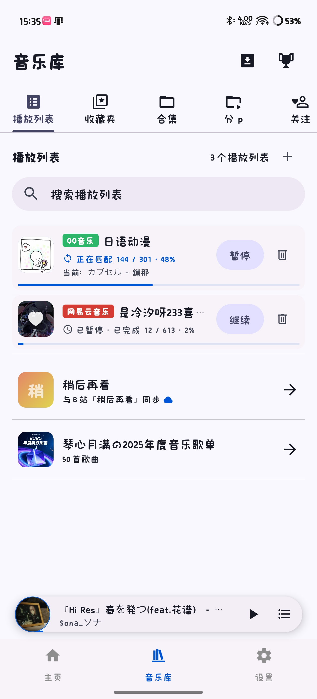 | 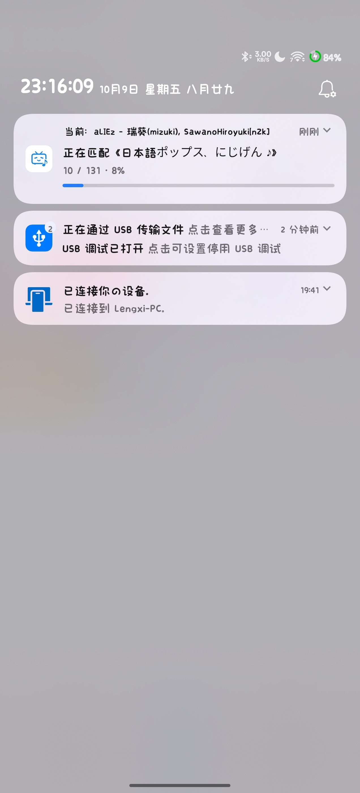 |

---

### 2. 多源外部歌单智能解析与凭证配置

- **多平台解析与本地导入**：支持网易云音乐、QQ音乐、酷狗音乐、汽水音乐等链接解析，并支持通过本地导出的 JSON 文件离线导入，兼容旧版直连模式。
- **酷狗专属凭据配置**：因酷狗官方限制第三方接口仅能获取前 10 首曲目，新增专属设置弹窗配置 Token 与 UID，提供网页端获取引导与一键测试连通性。

| 导入多源歌单弹窗 (`02_import_modal_sources.jpg`) | 酷狗凭据设置弹窗 (`03_kugou_settings_modal.jpg`) |
| :---: | :---: |
| 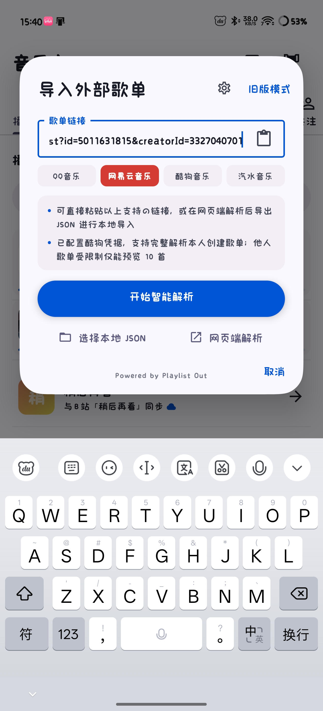 | 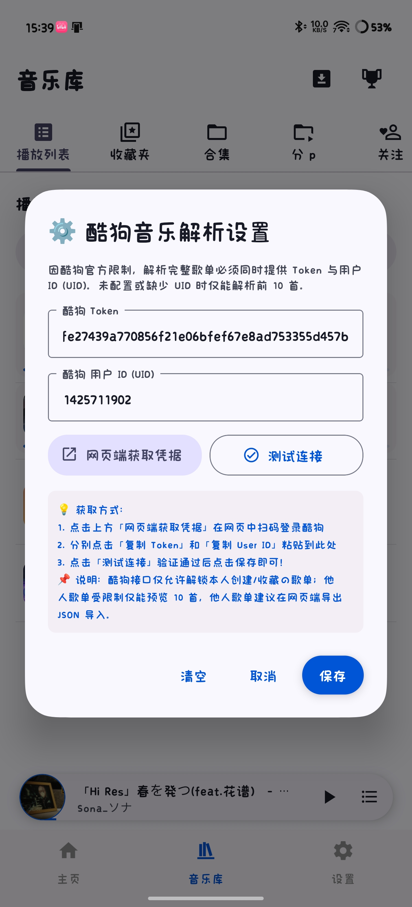 |

---

### 3. 实时匹配状态与风控熔断机制

- **实时状态与耗时估算**：匹配过程中实时展示单曲匹配状态、预计剩余时长估算（如“预计还需 6.1 分钟”），支持单曲手动编辑，支持随时“保存为本地歌单”。
- **B 站风控智能熔断**：当请求触发 B 站高频限制（412 / 429 / Code -412）时，自动触发熔断暂停，安全持久化当前进度，给出清晰的用户警示，防止高频重试导致封号或封禁 IP。

| 实时匹配与进度估算 (`06_matching_page_live_progress.jpg`) | 触发风控熔断自动暂停 (`07_circuit_breaker_rate_limit.jpg`) |
| :---: | :---: |
| 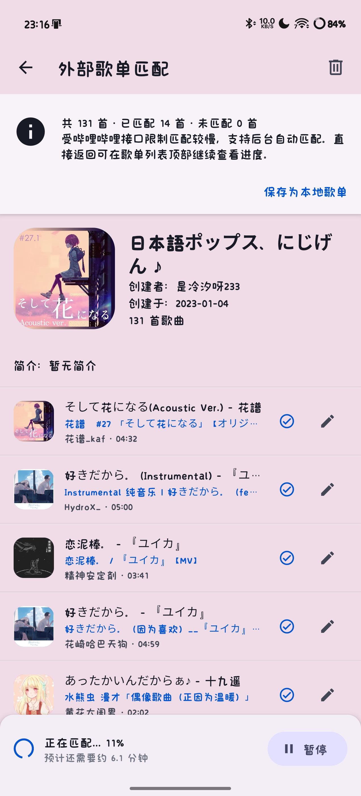 | 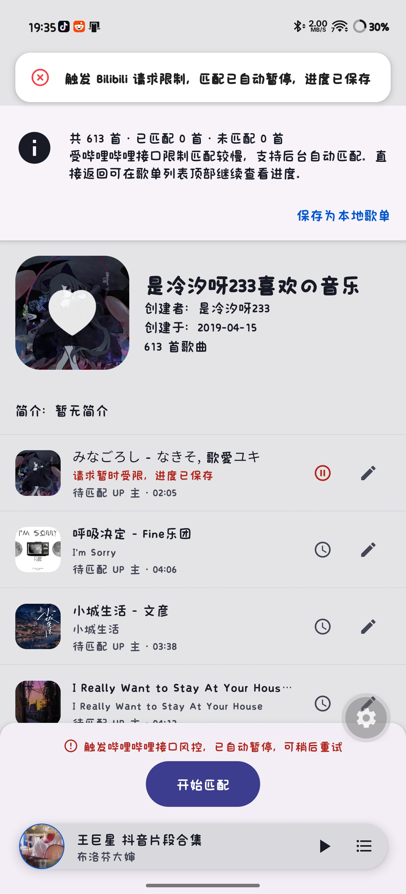 |

---

### 4. 歌单原曲/B站“双模视图”与未完成管理

- **双模视图一键切换**：歌单详情页操作栏新增 B 站图标切换按钮。点击可在“原曲模式”（原歌曲名、原歌手、原专辑、原封面）与“B 站音源模式”（B站视频标题、UP主、视频封面）间无缝切换，播放与列表同步跟随。
- **未匹配待办横幅**：保存未完全匹配的歌单后，详情页顶部常驻待办横幅，提供“继续自动匹配”与“查看未完成清单”。
- **未完成专属清单**：独立路由页面 (`unmatched.tsx`)，支持筛选待办歌曲，支持单曲直达手动匹配。

| 本地歌单待办横幅与双模切换 (`08_local_playlist_dual_view_and_todo.jpg`) | 未完成歌曲专属清单 (`10_unmatched_tracks_list.jpg`) |
| :---: | :---: |
| 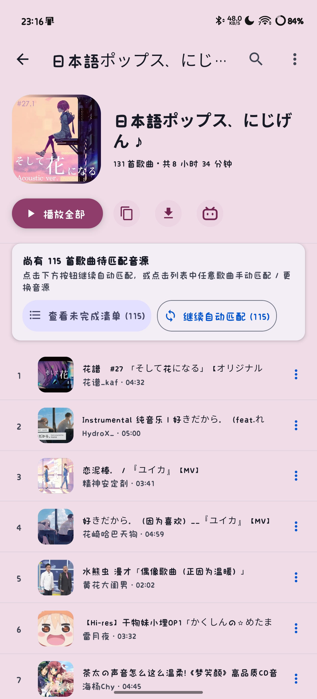 | 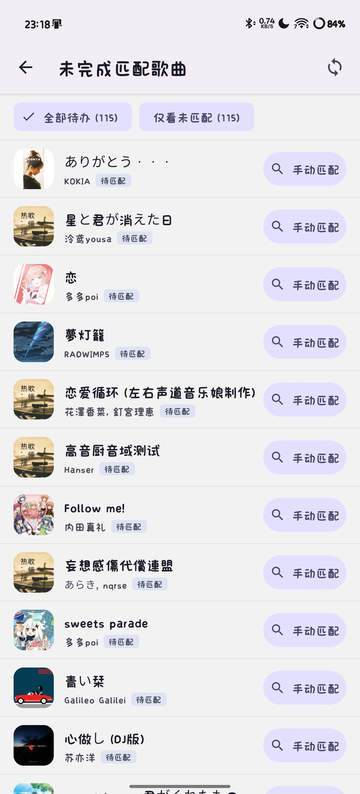 |

---

### 5. 单曲操作与手动匹配（带列表内即时试听）

- **单曲菜单快捷项**：歌曲操作菜单新增“手动匹配 B 站音源”入口。
- **搜索与即时试听**：手动匹配弹窗自动预填充歌曲关键词，搜索候选视频列表，**支持直接在弹窗内点击播放按钮试听音源**，确认后一键原位更新音源映射，不改变歌单原始排序与信息。

| 单曲操作菜单新增项 (`09_track_menu_manual_match_option.jpg`) | 手动匹配与即时试听弹窗 (`11_manual_search_and_preview_modal.jpg`) |
| :---: | :---: |
| 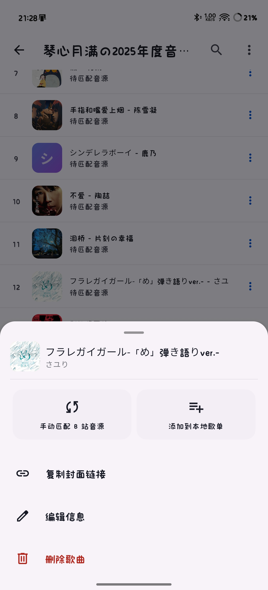 | 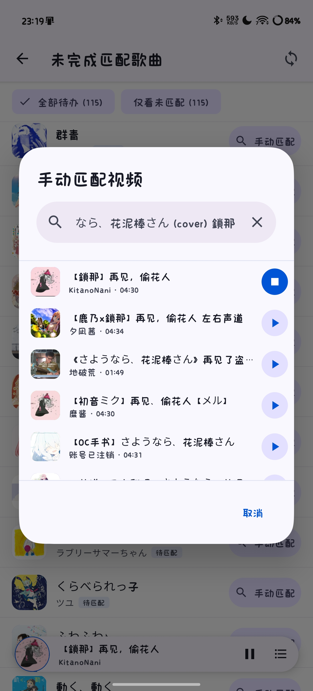 |

---

### 6. 🐛 关键 Bug 修复：NowPlayingBar 遮挡问题

- **问题现象**：当正在播放歌曲时，悬浮底栏（`NowPlayingBar`）会遮住匹配界面最下方的“开始匹配”与控制操作按钮。
- **修复方案**：在 `external-sync.tsx` 中结合 `useCurrentTrack()` 与 `nowPlayingBarStyle` 动态计算安全垫片间距（`nowPlayingOffset`），确保底部操作栏随悬浮播放条自适应抬升。

| 修复前：播放条遮挡匹配操作栏 (`01_bug_nowplayingbar_overlap.jpg`) |
| :---: |
| 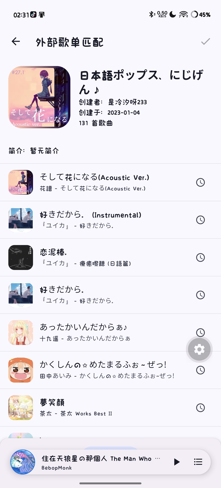 |

---

## 🏗️ 架构与数据表设计 (Technical Architecture)

### 1. 数据库迁移 (Drizzle Migration `0023`)
新增三张核心持久化表结构：
- **`external_import_jobs`**：导入任务主表。记录来源、原始元数据快照、统计指标（总数、已处理、匹配、未匹配、失败、限流数）、任务状态（`pending` / `running` / `paused` / `rate_limited` / `completed_waiting_confirmation` / `completed`）、关联本地歌单 ID。
- **`external_import_items`**：单曲导入项表。记录单曲指纹（`fingerprint`）、原始序号、原始单曲 JSON 快照、匹配状态与匹配到的视频数据。与主任务级联删除（`ON DELETE CASCADE`）。
- **`external_track_mappings`**：正式歌单映射表。记录本地 `trackId`、`playlistId` 与外部原曲元数据、B 站音源视频数据的映射关联，支持双模视图转换与就地重匹配。

### 2. 状态机与 Background Worker
- **单任务互斥与状态管理**：`ExternalPlaylistImportWorker` 保证同一时间仅有一个任务处于活跃执行态，切换任务时自动保存前序任务状态。
- **冷启动与僵尸任务恢复**：应用启动或强杀恢复时，`recoverStuckJobs()` 自动将异常残留的 `running` 状态回退至 `paused`。
- **孤立任务级联清理**：当本地歌单被删除时，自动联动清理关联的导入任务与音源映射，避免历史数据残留。

### 3. 主题色调色板缓存 (MMKV + Memory)
- 优化 `usePlaylistBackgroundColor`：对于重复打开的歌单封面，将提取的主题色调色板持久化至 MMKV，避免高开销的原生图像像素提取运算。

---

## 🧪 校验与测试结果 (Verification)

本 PR 经过完整的质量验证与自动化测试覆盖：

1. **类型检查**：`pnpm type-check` 全量通过（0 类型错误）。
2. **代码风格检查**：`pnpm lint` (`oxlint --type-aware`) 全量通过，扫描 476 个文件，0 错误 0 警告。
3. **原生构建**：`packages/native` 模块在 Android Gradle 下通过 `compileDebugKotlin` 编译。
4. **数据库一致性**：`drizzle-kit generate` 验证无多余 schema diff，迁移文件与 snapshot 100% 同步。
5. **自动化单元测试**：编写了针对 Stage 1 ~ Stage 6 的全量 Jest 测试套件（`jest.external-sync.config.cjs`），**28 个测试用例全部通过**：
   - Stage 1: 风控熔断判定与防误关联机制
   - Stage 2: 持久化 Job/Item 模型与 MMKV 兼容迁移
   - Stage 3: 解耦式 ImportWorker 与后台状态转移
   - Stage 4: 原生通知与 Live Activity 载荷生成
   - Stage 5: 音乐库草稿卡片列举与冷启动恢复
   - Stage 6: 正式歌单双模元数据变换与就地单曲重匹配
